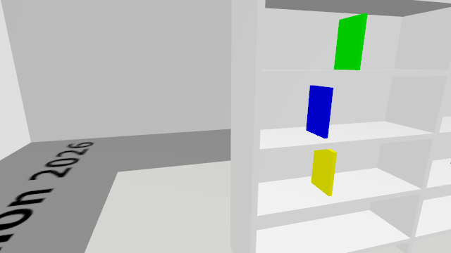
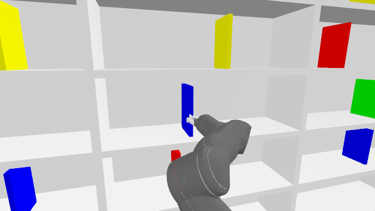
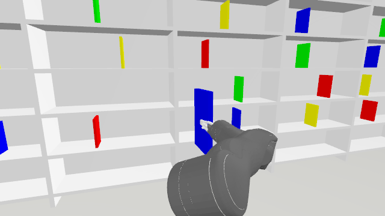
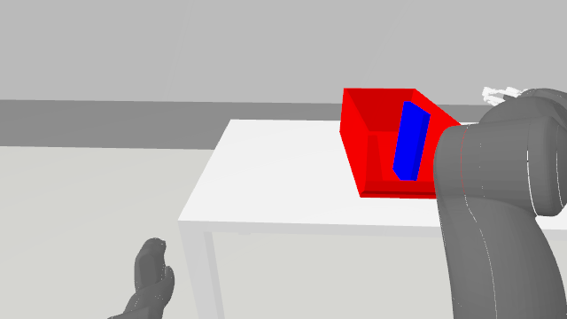

# ERC development demonstration

Status: **one verified physical pickup-to-bin diagnostic sequence; competition entry still incomplete**.

## Executed in the official simulator

| Step | Evidence |
|---|---|
| Right-arm lift | Action success, final joint feedback checked; 15.20 simulated seconds |
| Forward approach with raised right arm | Odometry goal reached; no detected external contact |
| Right-arm pregrasp | Action success, final joint feedback checked; 3.91 simulated seconds |
| Automated checks | 75 passing tests |
| Fresh randomized scene05 approach | Column5/blue identified and reacquired; 203.50 s wall time; no grasp attempted |

These were development diagnostics in scene04. The book remained on the shelf.
The following image is the robot's actual camera view after right-arm alignment,
not a generated illustration and not proof of a successful grasp.

Logs: [arm lift](docs/sources/right-arm-lift-01.log),
[raised-arm approach](docs/sources/raised-arm-approach-01.log),
[pregrasp execution](docs/sources/pregrasp-aligned-01.log).

## Still required

- Integrate the verified manipulation and delivery stages into one autonomous mission.
- Confirm row numbering and complete five randomized full trials.
- Produce the final competition report and unedited demonstration video.

Gazebo exited on an X-server error after the pregrasp. The simulator was restarted
with the organizer's headless mode. Old scene coordinates and plans are invalid.
See [project status](PROJECT_STATUS.md) for the latest running trial and results.

Latest manipulation test, 12 September: the open fingertip contacted the target,
and recovery left the book lying flat. The detector rejected that geometry and
stopped without closing. This is a failed grasp attempt, not a completed entry.
[Failure camera frame](docs/sources/book-toppled-scene06.png).

Scene07: fresh column5/blue navigation passed. The revised lateral alignment and
straight pregrasp executed. Whole-body checks rejected the closest base approach
before motion; shorter advances passed. Insertion planning isolated a relative
joint-jump filter rejection: identical collision-checked requests returned 100%
with the relative filter off versus 92.3% with it on. An absolute 1.5 rad per-joint
travel bound now guards Cartesian paths alongside sampled collision, speed and
feedback checks. The corrected insertion executed and a physical pinch passed.

Scene07 now has verified opposing fingertip contact, retained withdrawal and
return to the recorded start position (about 1 cm position error). Withdrawal
needed a continuation after a wall-time deadline under slow simulation. These
are linked diagnostics, not an uninterrupted full competition trial. The MoveIt
carried collision object supplies no physical attachment or force in Gazebo.
Bin placement subsequently passed, with sustained matching book/bin contact after
release and no robot/book contact. The hand withdrew; the book remained in the bin.

## Verified physical delivery

[Contact evidence](docs/sources/physical-delivery-scene07.json) and
[execution log](docs/sources/physical-delivery-scene07b.log).
This sequence included diagnostic stops and code fixes. It does not count as one
of the five required uninterrupted full trials and is not the competition video.
